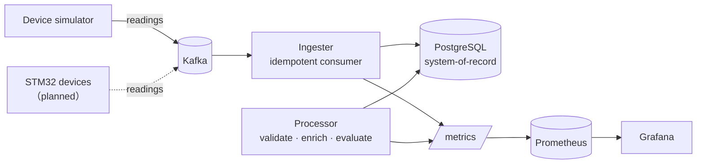

# Sensorline

[](https://github.com/bowarrowM/sensorline/actions/workflows/ci.yml)

A fault-tolerant ingestion and investigation platform for sensor telemetry —
event-streaming ingest, an immutable system-of-record with full per-reading
traceability, and anomaly detection you can query after the fact.

Built with Kafka, PostgreSQL, Prometheus and Grafana; services in Python.

## Why this exists

I build small embedded sensor devices (STM32 + peripherals). Once more than one
device runs for more than a few hours, the same problem appears: **sensor data
fails and drifts silently.** A probe reads high after it warms up, a device
drops off the network, a value spikes once and is never seen again — and by the
time you notice, the raw stream is gone and you cannot answer *what happened, to
which device, and when.*

This platform is the backend for that: it ingests every reading, keeps a full
per-reading trace, and makes any past value **investigable with a query instead
of a guess.** Devices are simulated today against the same contract the real
hardware will use, so the pipeline is developed and load-tested ahead of the
physical build.

## What it does

- **Ingests** readings from a Kafka topic; any device onboards via config, never
  code.
- **Idempotent writes** — at-least-once delivery plus a unique-constraint sink
  means replaying the topic never double-counts.
- **Reading genealogy** — every reading records each stage it passes through
  (`ingested → validated → enriched → evaluated`), so a flagged value is
  traceable long after.
- **Anomaly detection** — point checks (out-of-range, spike vs. a trailing
  window) and window checks (drift vs. baseline, offline gap), all idempotent.
- **Observability** — Prometheus metrics from every service and a provisioned
  Grafana dashboard.
- **Reproducible faults** — the simulator can inject drift / offline / spike
  scenarios, which back the worked incident write-ups.

## Architecture



The ingester is the hot path (write + structural validation only). Anything that
needs history — rolling statistics, drift, gap detection — runs in the separate
processor. Design reasoning (delivery semantics, commit ordering, failure modes)
is in [`docs/ARCHITECTURE.md`](docs/ARCHITECTURE.md); worked investigations are
in [`docs/incidents/`](docs/incidents/).

A query-performance study on a 3.45M-row table — profiling three slow paths with
`EXPLAIN (ANALYZE, BUFFERS)` and fixing them (BRIN index, a LATERAL rewrite that
takes latest-per-device from 48s to 0.4ms, and a materialized rollup) — is in
[`docs/sql-performance.md`](docs/sql-performance.md), reproducible via
[`db/perf/run.sh`](db/perf/run.sh).

## Project structure

```
common/       config, wire contract (Reading), data-access layer
simulator/    device fleet (devices.yaml) + fault injection + backfill
ingester/     Kafka consumer → Postgres, idempotent, exposes metrics
processor/    evaluation + anomaly detection; tuning in config.yaml
db/           schema.sql, investigative queries in queries/, perf study in perf/
grafana/      provisioned datasources + dashboard
prometheus/   scrape config
docs/         ARCHITECTURE.md + incidents/
```

## Quickstart

Everything runs in Docker. One command brings up the infrastructure **and** the
pipeline services (simulator → ingester → processor); the schema is applied on
first boot.

```bash
cp .env.example .env
make up            # build + start everything (docker compose up -d --build)
```

Open Grafana at http://localhost:3001 (dashboard **Sensorline**
auto-loads) — live data appears within a few seconds. Query Postgres directly on
`localhost:5434` with the SQL in [`db/queries/`](db/queries/).

To replay a specific fault instead of the live feed:

```bash
docker compose run --rm simulator python -m simulator --backfill-minutes 15 --scenario drift
```

### Running a service on the host (dev)

To iterate on one service without rebuilding its image, run the infra in Docker
and the service locally:

```bash
python -m venv .venv && source .venv/bin/activate && pip install -r requirements.txt
docker compose up -d postgres kafka prometheus grafana
make db-init        # if the DB volume is fresh
make ingest         # or make process / make simulate
```

## Tests

```bash
pip install -r requirements-dev.txt
make test          # or: python -m pytest
```

Integration tests run against a `telemetry_test` database on the local Postgres
(created automatically); each test runs in a rolled-back transaction for
isolation. Covered: idempotent ingest, anomaly detection (drift, spike,
out-of-range, offline gap), genealogy completion, config loading, and the wire
contract.

## Configuration

Two kinds of config, deliberately separated:

- **Infrastructure** — hosts, ports, topic, credentials — from environment /
  `.env` (see [`.env.example`](.env.example)).
- **Domain tuning** — detection windows and per-metric limits — in
  [`processor/config.yaml`](processor/config.yaml).

### Credentials

All credentials come from the environment. `docker-compose.yml` and the Grafana
datasource read `${POSTGRES_USER}` / `${POSTGRES_PASSWORD}` etc., so no real
secret lives in a committed file. The values in `.env.example` are **local-dev
defaults only** — valid against the local stack, meant to be replaced in any real
deployment. `.env` is gitignored.

## Ports

| Service    | Host port |
|------------|-----------|
| PostgreSQL | 5434      |
| Kafka      | 19092     |
| Prometheus | 9091      |
| Grafana    | 3001      |

Offset from the defaults so this runs alongside other local projects.

## Roadmap

- [ ] Real STM32 source emitting to the same `telemetry.readings` contract
- [ ] Go ingester variant (throughput comparison against the Python one)
- [ ] Reading-genealogy view in a small React status UI
