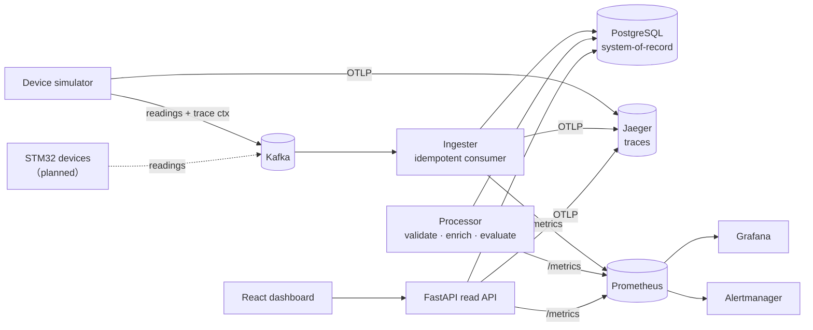

# Sensorline

[](https://github.com/okyaymelike/sensorline/actions/workflows/ci.yml)

A fault-tolerant ingestion and investigation platform for sensor telemetry —
event-streaming ingest, an immutable system-of-record with full per-reading
traceability, and anomaly detection you can query after the fact.

Event-streaming ingest (Kafka) into a PostgreSQL system-of-record, a FastAPI read
layer, and a React and TypeScript dashboard — with full observability:
OpenTelemetry distributed tracing, Prometheus and Grafana metrics, structured
logging, and Alertmanager. Pipeline services in Python.

## Why this exists

I build small embedded sensor devices (STM32 + peripherals). Once more than one
device runs for more than a few hours, the same problem appears: **sensor data
fails and drifts silently.** A probe reads high after it warms up, a device
drops off the network, a value spikes once and is never seen again — and by the
time you notice, the raw stream is gone and you cannot answer *what happened, to
which device, and when.*

This platform is the backend for that: it ingests every reading, keeps a full
per-reading trace, and makes any past value **investigable with a query instead
of a guess.** Devices are simulated today against the same contract the real
hardware will use, so the pipeline is developed and load-tested ahead of the
physical build.

## What it does

- **Ingests** readings from a Kafka topic; any device onboards via config, never
  code.
- **Idempotent writes** — at-least-once delivery plus a unique-constraint sink
  means replaying the topic never double-counts.
- **Reading genealogy** — every reading records each stage it passes through
  (`ingested → validated → enriched → evaluated`), so a flagged value is
  traceable long after.
- **Anomaly detection** — point checks (out-of-range, spike vs. a trailing
  window) and window checks (drift vs. baseline, offline gap), all idempotent.
- **Read API & dashboard** — a FastAPI read layer over the system-of-record and a
  React and TypeScript dashboard: a grouped fleet view, per-device investigation
  with a rolling baseline band and anomaly markers, reading-genealogy drill-down,
  and an anomaly Pareto, with live auto-refresh and an EN/DE toggle.
- **Distributed tracing** — OpenTelemetry spans propagated through the Kafka
  message headers, so one trace follows a reading `simulate → ingest` across the
  broker; the read API and its DB calls are traced too. Exported to Jaeger.
- **Metrics, logs & alerts** — Prometheus RED and USE metrics with a provisioned
  Grafana dashboard, structured JSON logs correlated to traces, and Prometheus
  alert rules routed to Alertmanager.
- **Reproducible faults** — the simulator can inject drift / offline / spike /
  out-of-range scenarios (several at once), which back the worked incident
  write-ups.

## Architecture



The ingester is the hot path (write + structural validation only). Anything that
needs history — rolling statistics, drift, gap detection — runs in the separate
processor. Design reasoning (delivery semantics, commit ordering, failure modes)
is in [`docs/ARCHITECTURE.md`](docs/ARCHITECTURE.md); worked investigations are
in [`docs/incidents/`](docs/incidents/).

A query-performance study on a 3.45M-row table — profiling three slow paths with
`EXPLAIN (ANALYZE, BUFFERS)` and fixing them (BRIN index, a LATERAL rewrite that
takes latest-per-device from 48s to 0.4ms, and a materialized rollup) — is in
[`docs/sql-performance.md`](docs/sql-performance.md), reproducible via
[`db/perf/run.sh`](db/perf/run.sh).

## Observability

- **Tracing** — every service is OpenTelemetry-instrumented. The simulator injects
  trace context into the Kafka message headers and the ingester extracts it, so a
  single Jaeger trace follows a reading `simulate → ingest` across the broker; the
  read API and its DB queries are traced too. Exported over OTLP to Jaeger
  (http://localhost:16686). In the UI, pick service `sensorline-simulator` and
  open a trace to see the two-service waterfall.
- **Metrics** — Prometheus scrapes RED metrics from the API and USE-style metrics
  from the pipeline (throughput, Kafka consumer lag, end-to-end ingest lag,
  processor sweep time). The *Sensorline — Observability* Grafana dashboard
  (http://localhost:3001/d/sensorline-obs) renders them.
- **Logging** — structured JSON logs on stdout, with `trace_id` and `span_id`
  attached whenever a log is emitted inside a span.
- **Alerting** — Prometheus alert rules (service down, pipeline stalled, high
  consumer lag, high ingest lag, API 5xx) routed to Alertmanager
  (http://localhost:9093). Run `docker compose stop ingester` to watch one fire.

## Project structure

```
common/       config, wire contract (Reading), data-access layer, telemetry (tracing + JSON logging)
simulator/    device fleet (devices.yaml, devices.demo.yaml) + fault injection + backfill
ingester/     Kafka consumer → Postgres, idempotent, traced, exposes metrics
processor/    evaluation + anomaly detection; tuning in config.yaml
api/          FastAPI read layer over the system-of-record (traced, RED metrics)
web/          React + TypeScript dashboard (Vite, TanStack Query, Recharts)
db/           schema.sql, investigative queries in queries/, perf study in perf/
grafana/      provisioned datasources + dashboards (pipeline + observability)
prometheus/   scrape config + alert rules
alertmanager/ alert routing config
docs/         ARCHITECTURE.md + incidents/
```

## Quickstart

Everything runs in Docker. One script builds and starts the whole stack — infra,
the pipeline (simulator → ingester → processor), the read API, and the
observability stack — seeds a few minutes of history, prints the URLs, and then
starts the dashboard. The schema is applied on first boot.

```bash
./setup.sh         # brings up everything, then runs the dashboard on :5173
```

Press ctrl-c to stop the dashboard; the Docker stack keeps running in the
background. To run just the dashboard later (for example after `make up`):

```bash
make web           # cd web && npm install && npm run dev
```

| What | URL |
|------|-----|
| Dashboard | http://localhost:5173 |
| Read API | http://localhost:8080/api/fleet |
| Jaeger (traces) | http://localhost:16686 |
| Grafana (RED/USE) | http://localhost:3001/d/sensorline-obs |
| Prometheus | http://localhost:9091 |
| Alertmanager | http://localhost:9093 |

In Jaeger, pick service `sensorline-simulator` and open a trace to watch
`emit reading → ingest reading` span the Kafka boundary. Query Postgres directly
on `localhost:5434` with the SQL in [`db/queries/`](db/queries/).

To seed more history, or replay a specific fault:

```bash
make seed          # 5 min of history with the demo faults
```

### Running a service on the host (dev)

To iterate on one service without rebuilding its image, run the infra in Docker
and the service locally:

```bash
python -m venv .venv && source .venv/bin/activate && pip install -r requirements.txt
docker compose up -d postgres kafka prometheus grafana
make db-init        # if the DB volume is fresh
make ingest         # or make process / make simulate
```

## Tests

```bash
pip install -r requirements-dev.txt
make test          # or: python -m pytest
```

Integration tests run against a `telemetry_test` database on the local Postgres
(created automatically); each test runs in a rolled-back transaction for
isolation. Covered: idempotent ingest, anomaly detection (drift, spike,
out-of-range, offline gap), genealogy completion, config loading, and the wire
contract.

## Configuration

Two kinds of config, deliberately separated:

- **Infrastructure** — hosts, ports, topic, credentials — from environment /
  `.env` (see [`.env.example`](.env.example)).
- **Domain tuning** — detection windows and per-metric limits — in
  [`processor/config.yaml`](processor/config.yaml).

### Credentials

All credentials come from the environment. `docker-compose.yml` and the Grafana
datasource read `${POSTGRES_USER}` / `${POSTGRES_PASSWORD}` etc., so no real
secret lives in a committed file. The values in `.env.example` are **local-dev
defaults only** — valid against the local stack, meant to be replaced in any real
deployment. `.env` is gitignored.

## Ports

| Service      | Host port |
|--------------|-----------|
| Dashboard    | 5173      |
| Read API     | 8080      |
| PostgreSQL   | 5434      |
| Kafka        | 19092     |
| Prometheus   | 9091      |
| Grafana      | 3001      |
| Jaeger UI    | 16686     |
| Alertmanager | 9093      |

Offset from the defaults so this runs alongside other local projects.

## Roadmap

- [ ] Real STM32 source emitting to the same `telemetry.readings` contract
- [ ] Go ingester variant (throughput comparison against the Python one)
- [ ] Link the processor stage into the produce→ingest trace (carry the trace id on the reading row)
